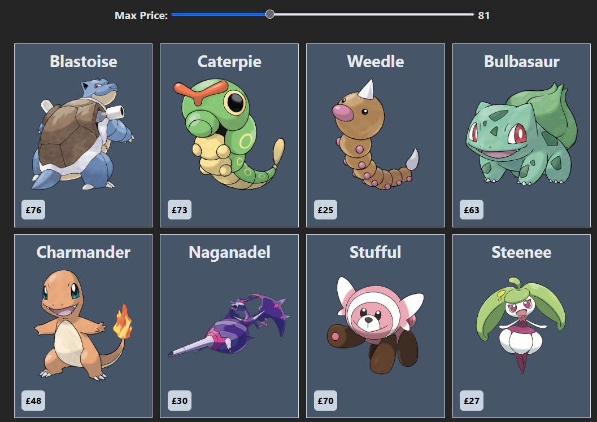

# Demo project for scrapping website data

This is a demo project that shows how to scrape data from an external website, save it to local database and then serve data from local API express server and display it to the user using React frontend.

# Running

1. Clone the project.
2. Install dependencies with `npm`:

```bash
npm install
```

3. Run scrapper
```bash
  npm run scrap
```
4. Run the API server
```bash
  npm run server
```
6. Run the frontend
```bash
  npm run dev
```

7. Visit the site at: http://localhost:5173 (Vite default)

You can adjust the price limit for items to be displayed. It uses local database so it will be fast and requests are debounced so it will also limit the IO.


